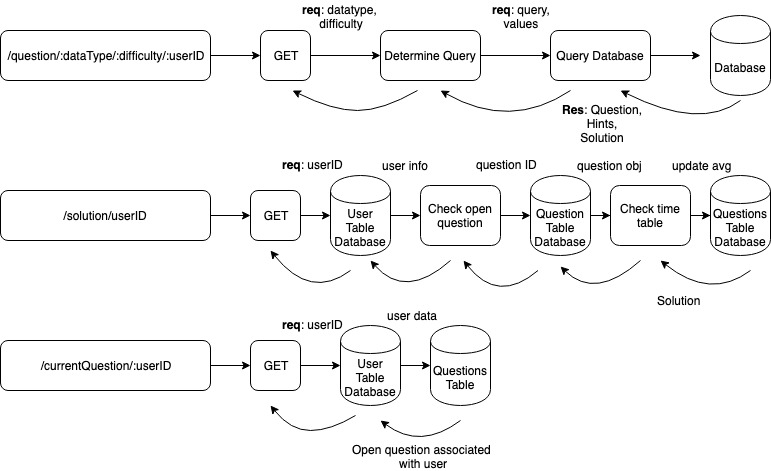

 LAB
=================================================

## Alexa Skills - Coding Interview Prep

### Author: Melissa Stock, Jagdeep Singh, Bonnie Wang, Jesse Van Volkinburg

#### Documentation
* [jsdoc](https://oh-of-one.herokuapp.com/docs)
* [swagger](https://oh-of-one.herokuapp.com/api-docs)

### Modules
#### `determineChallenge.js`
#### `endCurrentUserQuestion.js`
#### `getCurrentQuestion.js`
#### `getSolution.js`
#### `queryDatabase.js`
#### `server.js`
#### `setCurrentUserQuery.js`
#### `updateTime.js`

##### Exported Values and Methods

###### `determineChallenge(object) -> object`
Given an object with data type and difficulty keys, determines type of query to make and returns an object with the query and values.

###### `endCurrentUserQuestion(string) -> object`
Given a user id, update the session in the database and returns false (session ended) if successful.

###### `getCurrentQuestion(request, response) -> object`
Given a user id, checks the database for open questions associated with that user. Returns an object with the question details if successful, or an empty array if there are no open questions.

###### `getSolution(request, response) -> object`
Given a user id, calls getCurrentQuestion(), calls updateTime(), and returns an object containing question details.

###### `queryDatabase(string, array) -> array`
Given a query and values, queries the database and returns an array containing information about selected question.

###### `server(PORT) -> object`
Given a port, returns an object containing an express server.

###### `setCurrentUserQuestion(string, string)`
Given a user id and question id, if user exists update database to show user has an open question.
If user doesn't exist, add them to the database and show that the user has an open question.

###### `setCurrentUserQuestion(object, integer) -> object`
Given an object containing the question details and the time taken to complete the question, calculate the average time taken to solve that question and update the database. Returns the question object.

### Setup
#### `.env` requirements
* `PORT` - Port Number
* `DATABASE_URL` - URL to the running postgress instance/db

#### Running the app
* `npm start`
* Example Endpoint: `question/:dataType/:difficulty/:userID`

* Endpoint: `question/:array/:easy/:userID`
  * Returns a JSON object with an easy difficulty array coding challenge in it.
* Endpoint: `question/:array/:medium/:userID`
  * Returns a JSON object with a medium difficulty array coding challenge in it.
* Endpoint: `question/:array/:hard/:userID`
  * Returns a JSON object with an hard difficulty array coding challenge in it.
* Endpoint: `question/:array/:all/:userID`
  * Returns a JSON object with a random difficulty array coding challenge in it.
  
* Endpoint: `question/:string/:easy/:userID`
  * Returns a JSON object with an easy difficulty string coding challenge in it.
* Endpoint: `question/:string/:medium/:userID`
  * Returns a JSON object with a medium difficulty string coding challenge in it.
* Endpoint: `question/:string/:hard/:userID`
  * Returns a JSON object with an hard difficulty string coding challenge in it.
* Endpoint: `question/:string/:all/:userID`
  * Returns a JSON object with a random difficulty string coding challenge in it.
  
* Endpoint: `question/:list/:easy/:userID`
  * Returns a JSON object with an easy difficulty list coding challenge in it.
* Endpoint: `question/:list/:medium/:userID`
  * Returns a JSON object with a medium difficulty list coding challenge in it.
* Endpoint: `question/:list/:hard/:userID`
  * Returns a JSON object with an hard difficulty list coding challenge in it.
* Endpoint: `question/:list/:all/:userID`
  * Returns a JSON object with a random difficulty list coding challenge in it.
  

* Endpoint: `/solution/:userID`
 * Returns a JSON object with all details about question being worked on.

* Endpoint: `/currentQuestion/:userID`
 * Returns a JSON object with all details about question being worked on.

  
#### Tests
* How do you run tests? `npm run test`
* What assertions were made?
 * API Server:
    * Should get a question matching the given datatype
    * Should handle errors when a datatype does not exist
    * Should only response with a valid user id
    * Should respond with the solution when the user is complete
    * Should update the database for each question asked
* What assertions need to be / should be made?
 * Lambda function hosted on AWS
 * Alexa Skill Kit

#### UML

